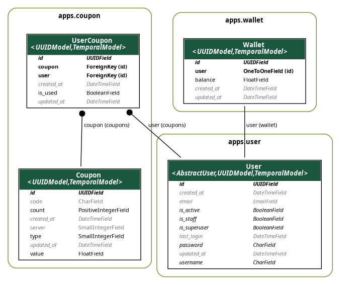

# Cloud-Coupon

Simple cloud-coupon web app with [Django](https://www.djangoproject.com/).

### Routes:

| Route         | URL                                                           |
| ------------- | ------------------------------------------------------------- |
| `admin`       | [0.0.0.0:8800/admin/](http://0.0.0.0:8800/admin/)             |
| `swagger`     | [0.0.0.0:8201/swagger/](http://0.0.0.0:8800/swagger/)         |
| `healthcheck` | [0.0.0.0:8201/healthcheck/](http://0.0.0.0:8800/healthcheck/) |

### Database Schema:



## Usage

Generate a JWT `RS256` key-pair:

```sh
./scripts/keygen.sh
```

Collect static files:

```sh
python manage.py collectstatic
```

---

## Deployment

> Make sure you have [Docker](https://www.docker.com/) and [Docker Compose](https://docs.docker.com/compose/) installed.

Build and start the services:

```sh
docker compose up
```

---

## Local

> Make sure you have [Python 3.11.2](https://www.python.org/downloads/release/python-3112/) installed.

> You also need to have [PostgreSQL](https://www.postgresql.org/) installed and running on your system.

Make all the `.sh` files executable:

```sh
find . -type f -iname "*.sh" -exec chmod +x {} \;
```

Create and activate a virtual environment:

```sh
python -m venv .venv
source .venv/bin/activate
```

Install all the requirements:

```sh
pip install -r requirements.txt
pip install -r requirements.dev.txt
```

Run migrations:

```sh
python manage.py migrate
```

Create admin superuser and seed initial data:

```sh
python manage.py createadmin
python manage.py seed
```

Run the service:

```sh
./scripts/run.sh
```

---

## Testing

### Coverage:

Run coverage with:

```sh
./scripts/coverage.sh
```

> Coverage is at `87%`.

### API Testing:

Obtain a token from [0.0.0.0:8800/api/v1/user/login/](http://0.0.0.0:8800/api/v1/user/login/) with the following data for testing the API's.

```json
{
    "username": "parsa",
    "password": "1234"
}
```

> Postman collection can be found [here](docs/cloud-coupon.postman_collection.json).

> All the seeded user's passwords are `1234`.
